1D Bruker NMR Analysis
**********************

Analysis of 1D Bruker NMR data files including alignment, Icoshift segmental alignment,
exclusion of regions, normalisation (PQN) and spectral binning. Data are subsequently
assigned experimental classes, then annotated using the MetaboHunter online 
NMR peak identification service, analysed using a simple PLS-DA and also exported
as a standard CSV format datafile for subsequent analysis.

You can download the `completed workflow`_ or follow the steps below to recreate it yourself.
This workflow is also distributed with the latest versions of Pathomx and can be found within
the software via *Help > Demos*.

The data used in this demonstration was derived from the culture of THP-1 macrophage cell 
line under hypoxic conditions for 24hrs. Metabolites were extracted using a methanol-chloroform protocol.
The class groups used here represent (N)ormoxia and (H)ypoxia respectively.

Background
==========

1D NMR is commonly used in metabolomics as a relatively quick and inexpensive method for 
profiling compounds in biological fluids. Processing of 1D NMR data involves a number of 
commonly applied steps. While the parameters applied to different NMR datasets may need to 
be altered, the series and order of applied steps tends to stay the same. This demo workflow 
provides a good standard base for customising your own analysis workflow and this tutorial will cover
the process of extending the workflow further. Finally, a quick multivariate analysis will be performed.

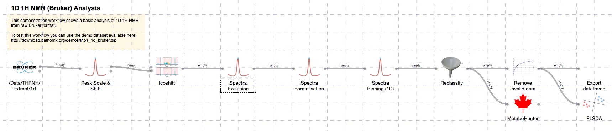

To test the workflow as it's built you'll need to download the `demo dataset`_ and `sample classification`_
files. Unzip the dataset before use (the Bruker import tool requires a folder to open). The sample 
classification file is in CSV format and maps the NMR sample numbers to a specific class group.

Constructing the workflow
=========================

The workflow will be constructed step-by-step using the default toolkit supplied with Pathomx
and a sample set of outputs shown along the way. If you find anything difficult to follow, `let
us know`_.

Importing data
--------------

Start up Pathomx and find the Bruker Import tool in the Toolbox panel on the left (the icon
is the Bruker atomic logo). Drag and drop it into the workflow editor to create a new instance
of the tool. Select it (turning it blue) to activate it and get access to the configuration panel.

The Bruker import tool supports a large number of configuration options. These are described in the help
documentation with the tool (`?` tab) so won't be covered here. For this demo we can use the default
values as-is. Simply click the open folder button and browse to the folder containing your spectra. If
you're using the downloaded demo dataset unzip it first, then select the resulting folder.

The tool will now run, importing each spectra in turn and performing an automatic phase correction
algorithm on the result. With the default settings a number of other functions will be performed 
including spectra reversal, deletion of the imaginary component, removal of the digital filter and
zero filling. The resulting imported spectra are shown below:

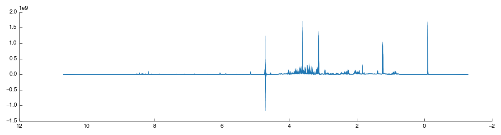
    
    
Spectral processing
-------------------

Next we'll perform a series of common NMR processing steps using the standard toolkit. As the data
has already been loaded, these tools will autoconnect as they are added.

The first step is to scale and shift spectra by a reference peak (e.g. TMSP). TMSP has been
added to all samples at the same concentration and so variation reflects differences in acquisition.
By scaling and shifting on this peak we can eliminate that variation from our data.

Start by dragging the *Peak Scale & Shift* tool into the workflow editor to the right of 
*Bruker Import*. It will connect and automatically calculate using the default settings 
of alignment on the TMSP peak - exactly what we want for this dataset. The resulting
data is output via `output_data` and two figures are generated `View` and `Region`. The former
is the full spectra view (after scaling) while the second is a close-up of the region which 
we've shiftd and scaled on. The two outputs are shown below:

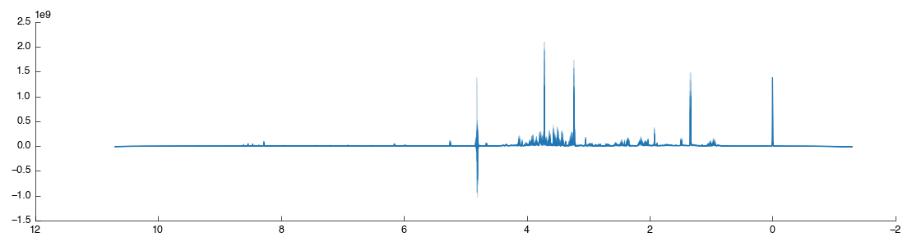

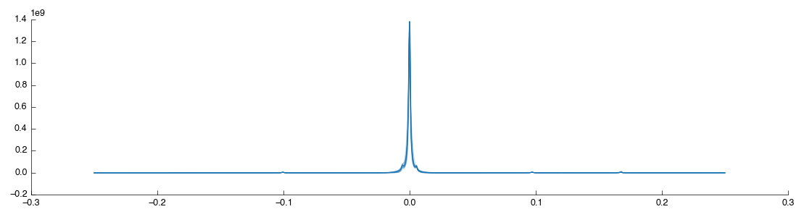

As shown the region around the TMSP peak has been well-shifted and scaled so that the various
spectra overlap well. For comparison the original unshifted, unscaled TMSP region is shown below
(as taken from the previous *Bruker Import* tool):

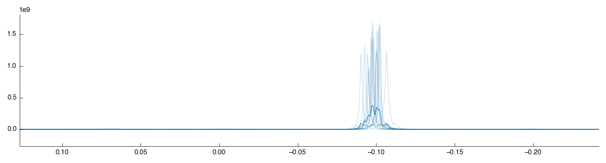

Although the spectra are now well aligned on the TMSP peak (accounting for shifting introduced by
the spectrometer) the alignment may not be as good elsewhere. Variation in the pH of the 
analysed samples results in a shift in the compound peaks (± H+). This can have implications
for later analysis as peak misalignment may make a compound appear to be reduced in a sample.
As we're interested in real biological concentration differences we must try and limit this
effect as far as possible. In this demo we'll make use of the *Icoshift* tool, which uses a Python implementation
of the *i*coshift segmental correlation shifting algorithm. Drag the tool into the workflow
editor to autoconnect it. It will take a short while to run, and produce the following figures:

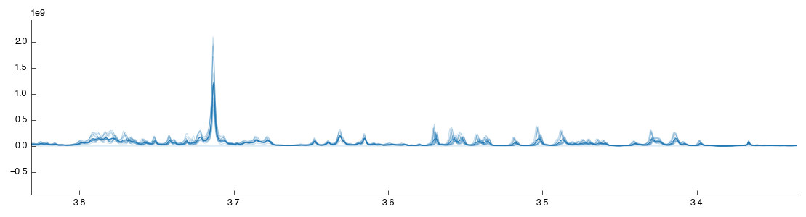
    
The default settings are not the most effective: by default it shifts the whole spectra towards
a mean of the spectra. As we've already shifted the spectra this has limited effect. To optimise the
shifting change the settings as follows:

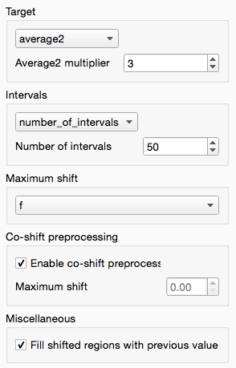

These settings do the following:

* Turn on co-shift preprocessing, a quick pre-shift to ensure alignment is maximised to begin with
* Change the target to average2, with weight of 3, for the most-average spectra to create a 'better' target
* Segmental shifting using 50 segments per spectra, allowing regions of the spectra to move independently to maximally align local peaks

The *Icoshift* tool also outputs a useful *Difference* plot that shows where the changes 
have occurred in the shifted spectra. You can use this to zoom in inspect whether the shift
is beneficial to the clarity of the spectra.

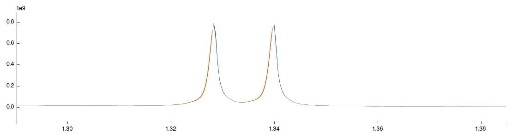

At this point we now have a optimally aligned set of spectra. The next step in NMR processing is to remove the 
uninformative parts of the spectra. These include the water region (noise) the TMSP reference peak (no longer required)
and the far 10 ppm + region of the spectra (for 1H metabolomic NMR this contains no useful information).

We can do all this in a single step using the *Spectra Exclusion* tool: simply drag and drop it into the workflow editor.
This tool comes with the standard 1H regions pre-defined but you can add and remove any regions you wish. 
After the tool has completed processing you will see the following figure:

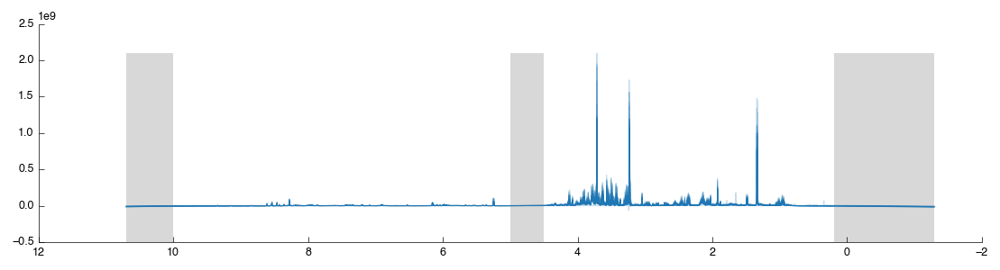

The excluded regions are shown in grey with flat-lines where data is missing. Let's now add
another exclusion region just to see how it is done: we will remove lactate since it is easy to find.
Zoom in on the lactate doublet peak  at 1.30-1.35:

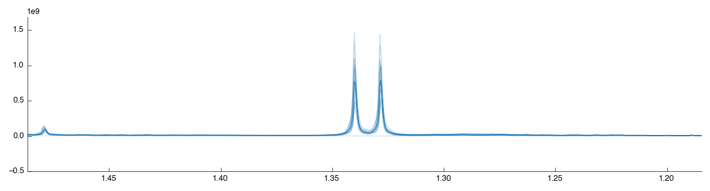

On the figure toolbar find the select region icon and click it to change to *Region* mode:

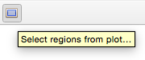

Drag a box over the lactate peak. Note that it doesn't matter if you contain the peak within 
the box, just that you cover the region on the X axis (this is a 1d plot). After you release the 
mouse the tool will auto-run with the new configuration and you should see the following:

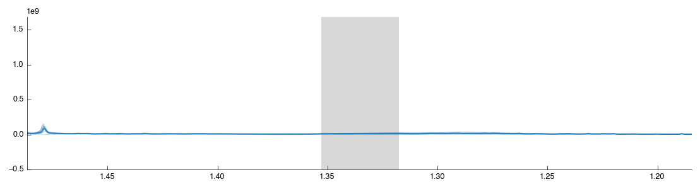

The region you created has also been added to the exclusion list in the configuration panel:

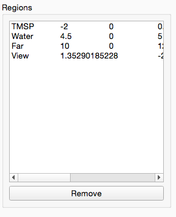

Select your region from the list and click "Remove" to remove it from the list and re-add
the lactate region to the output spectra. Remember you can always re-use this tool later on to remove regions
from the spectra that are causing issues in your downstream analysis.

Spectral binning
----------------

We've now got a set of spectra well-aligned and with all the useless data thrown away. However despite
our best efforts there still exist tiny variations in peak positions. *Binning* (also known as *bucketing*)
is the simplest method for the removal of this variation from tspectra. It splits the spectra up into multiple regions
of equal size and then takes the sum of the data within that region. This is a loss of resolution, but one
that aids further downstream analysis by simplifying comparison between spectra.

In Pathomx this can be achieved using the *Spectral binning* tool from the toolkit. Just drag and drop it
to the workflow editor to add it. It will run and produce the following figure: if you zoom in you'll
see that the spectra is now more pointy.

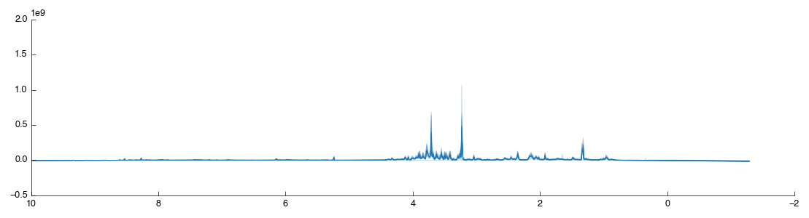

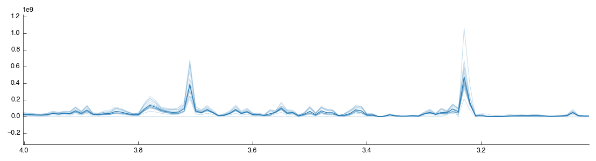

Spectral normalisation
----------------------

We now have the spectra processed for analysis. However there is another (optional) step
that can be used to help ensure variation observed in the spectra is indeed indicative of
biology and not a side effect of the source material. One of the major sources of variation
is dilution of the source material: particularly relevant in urinary metabolomics for example.

There are two common approaches for spectral normalisation used in metabolomics: Total Spectral Area (TSA)
and Probabilistic Quotient Normalisation (PQN). Both function on the similar principal that 
most of the spectra will remain the same between samples in an experiment. TSA scales to a constant area 
under the curve (AUC) and is effective of urinary metabolomics assuming that the variation is small: a single large
peak (contaminant) in a spectra will reduce all other peaks in the spectra and may incorrectly be interpreted as a reduction.
PQN is a further improvement which uses TSA as a pre-step but then scales spectra to match their medians. This 
is less susceptible to the contaminant peak effect but relies on well-aligned spectra.

Our source data is from methanol-chloroform extracts from cell culture where cell number variations
are a possibility. Here we'll use PQN to attempt to compensate (feel free to explore the analysis without this correction).

Drag and drop the *Spectra normalisation* tool into the workflow editor and it will automatically run. The default
algorithm is PQN and will produce the following figure:

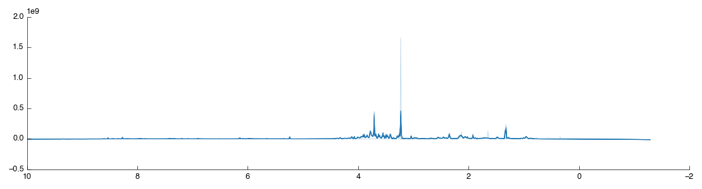

If you look closely you may notice that one of the spectra doesn't look right: 

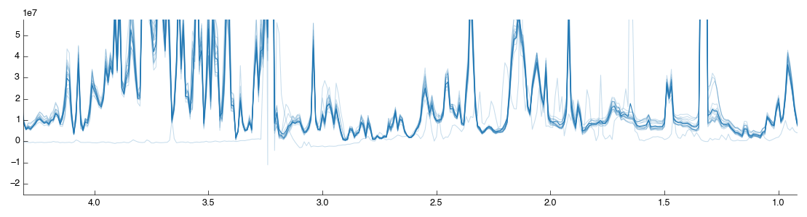

We'll look at how to filter spectra in a few minutes. For now, lets continue with the analysis.

Sample classification
---------------------

The plot shows data for all the samples together with the mean (shown as a thicker line) as dataset
doesn't currently contain any information on sample classifications. Let's add them now. Drag a 
*Reclassify* tool into the workflow editor. It will automatically take data from the *Spectral normalisation* tool.

If you select the Reclassify tool and select the View output you will see exactly what you saw in the BML-NMR tool.
That is because we haven't set up any reclassifications. You can do this in two ways: manual, or automatic from a CSV file import.
We'll do the first one manually, then give up and do it quickly.

Select the Reclassify tool you just created. In the configuration panel on the left select *Add* to get the reclassification box.
Select 'Sample' from the drop-down list (this means we're matching against the Sample number in the current data) and then enter
*85* in the input box. Under Replace enter *H* (this is the value we'll replace sample 85's class with). After you click OK
the assignment will be added with the reclassification table and the tool will recalculate.

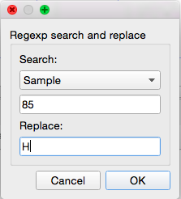
    

Select the *View* output and you will now see two lines: orange for the H class group and blue for the remaining unclassified samples.

That's not a huge amount of fun, so a quick way to get sample class matches is provided. To use this activate the Reclassify tool
then in the configuration panel click the Open File icon (bottom right, next to Add). Select the `1d_classifications.csv` file you
downloaded earlier and open it. You will be presented with a drop-down box to select the field on which to match, again choose 'Sample'.
The full set of class assignments will be loaded and samples assigned properly. If you check the view again you'll get 
two clearly marked groups like the image below:

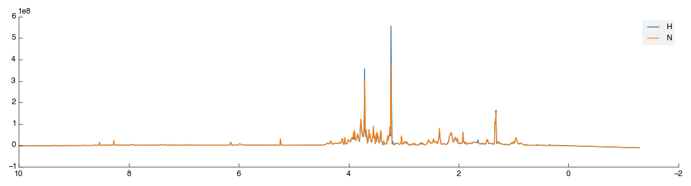

Except it isn't quite. Because we matched a single sample to begin with Pathomx needed a colour to identify the 'No class' group
and took the first available (blue). So instead of the above figure, you've probably got one in green and orange. To fix this
in the main application window select *Appearance > Line & Marker Styles*. You'll see this:

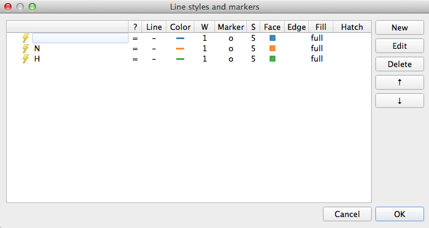

This dialog is the central control for the appearance of class groups in figures throughout Pathomx. Any change to
the colours assigned here determines how they show up in every figure. Select the row for
*N* and clicking Edit. For the Line setting click the colour button and then choose something obnoxious like pink.
Save the settings by clicking OK, reselect the Reclassify tool and click the green *play* button on the control bar to re-run it.
Your *N* line should now be pink.

Enough fun. Go back to *Appearance > Line & Marker Styles* and delete all the rows in the panel. Save it and return to your tool,
hitting run once more. Now you should have the data visualisation displaying as shown.

Metabolite Identification
-------------------------

Metabolite identification from 1D NMR is difficult. The gold standard for matching is via manual identification against
known compounds. Software packages such as Chenomx come a close second but are costly. Thankfully there are a number
of free online matching services which, while not offering the same levels of accuracy, are sometimes *good enough* for
a first-look investigation. Pathomx includes an interface to one such service: MetaboHunter.

The service can be accessed simply by dragging and dropping the *MetaboHunter* tool into the workflow editor. Note that
this tool is paused by default (to avoid unneccessary requests to the server) and so you must run it manually. Either
right click and select "Run" or select the tool and click the green play icon on the toolbar.

One the run is complete you can see the HMDB annotations by clicking on the `output_data` (not currently shown in the plot: coming soon). These values
and annotations will persist through subsequent analysis and can be exported for use elsewhere. To do that now simply drag and 
drop a *Export dataframe* tool into the workflow editor. Select it and click the "Save..." icon to choose the target file.

Multivariate analysis
---------------------

Next we'll perform a quick multivariate analysis of our data using PLS-DA. Drag and drop the *PLS-DA* tool from
the toolbox into the workflow editor. It will auto-connect to the MetaboHunter output but that is fine. Let it run and
you'll get the following figures:

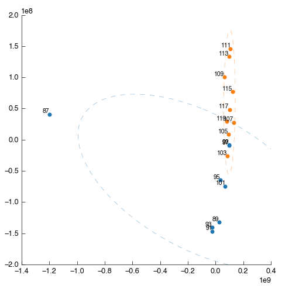

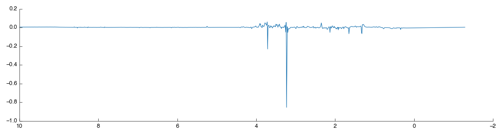

Something is wrong: one of the points (87) is way out to one side. What are the chances that this outlier is the same spectra
that we saw 'looking odd' before? We can filter this sample out by number (hint: use the *Filter* app and filter by sample number)
but we're smarter than that. First lets use PCA to find the source of weirdness in the data.

Drag and drop a *PCA* tool into the workspace. It will automatically connect to the output of MetaboHunter again, but reconnect it
to the output of *Spectra normalisation*. Still looks weird. 

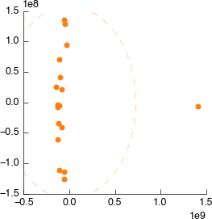

Connect it to *Spectral binning*. Still looks weird.

.. image:: ../images/demos/thp1_1d_bruker/weird_binning.png
    :alt: Weird output binning

Connect it to *Spectral exclusion*. Still looks weird.

Connect it to *Icoshift*. Still looks weird.

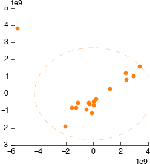

Connect it to *Peak Scale & Shift*. Still looks weird.

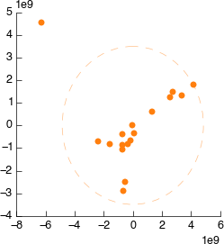

Connect it to *Bruker Import*. Still looks weird.

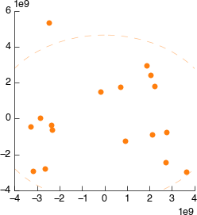

So, we've walked all the way back up our analysis and determined that the source of the 
weird spectra was - the spectra itself. We want to remove this data from the dataset as 
soon as possible to ensure it doesn't have strange effects on spectral alignment, scaling, etc.
downstream. So we'll get rid of it right at the beginning. As described we could remove this sample
by number, but instead we're doing to use a feature of the PCA tool to exclude dodgy samples dynamically.

On the PCA plot you'll notice a ellipse around the samples (or sample groups when classes are added). This
line indicates the 95% confidence line: the line in which the model predict 95% (2sd) of samples should fall.
Lets use this to automatically filter our samples. In the PCA tool select 'Filter data by covariance (2sd)'.

This will take a little while to complete, but once done you can drag the output `filtered_data` into the input
of the *Peak Scale & Shift* tool. The downstream analysis will re-run automatically and update, with the dodgy sample excluded.
This is our new PLS-DA:

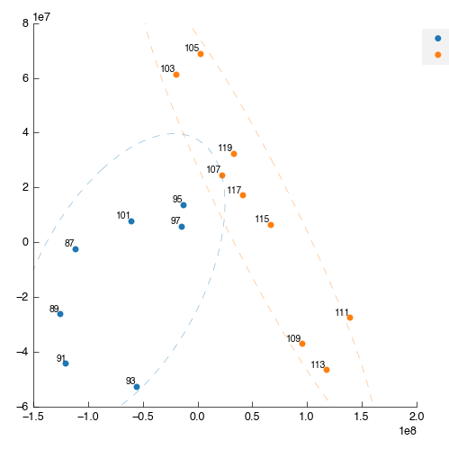

Looking at the raw spectra we can see it is also cleaner:

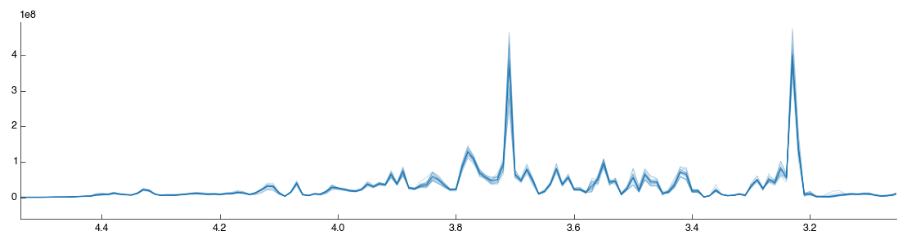

That concludes this demo of 1D Bruker analysis with Pathomx. If you found anything confusing, 
hard to follow (or impossible) let us know.

Things to try out
=================

If you're feeling adventurous there are a few things you can experiment with the workflow - 

- Export the MetaboHunter mapped data to a CSV format file *hint: use Export dataframe*

.. _completed workflow: http://download.pathomx.org/demos/thp1_1d_bruker.mpf
