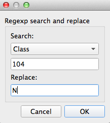

2D-JRES NMR (Bruker) Analysis via BML-NMR
*****************************************

Analysis of 2D J-Resolved NMR spectra (in Bruker format) previously processed using 
the `BML-NMR`_ service. The resulting processed data zip-file is loaded and assigned
experimental classifications. Metabolites are matched by name using the internal database
and then analysed using a PLS-DA. The log2 fold change is calculated for each metabolite 
(replacing zero values with a local minima). The resulting dataset is visualised on 
GPML/WikiPathways metabolic pathways. The data is additionally analysed using a pathway
mining algorithm and visualised using the MetaboViz pathway visualisation tool.

You can download the `completed workflow`_ or follow the steps below to recreate it yourself.
This workflow is also distributed with the latest versions of Pathomx and can be found within
the software via *Help > Demos*.

Background
----------

The Birmingham Metabolite Library (`BML-NMR`_) provided by the University of Birmingham
also hosts an automated NMR spectra fitting service designed for 2D JRES NMR spectra. These
low-resolution spectra have the advantage of being relatively quick to acquire while offering
the resonant peak-separation found in full 2D spectra. Quantification and identification
accuracy is in the 70-80% (dependent on source material) and may be sufficient for quick analyses.

This workflow takes the `.zip` output of the BML-NMR identification service and processes
it to perform multivariate analyses, visualisation on WikiPathways and pathway-analysis-generated
automated pathway visualisation. The overview of the pathway is as follows:

.. image:: ../images/demos/thp1_2d_jres_bml_nmr/workflow.png
    :alt: Overview of the demo workflow

To test the workflow as it's built you'll need to download the `demo dataset`_ and `sample classification`_
files. You don't need to unzip the dataset, it is the exact same format that comes out of 
the BML-NMR service and Pathomx can handle it as-is. The sample classification file is in CSV format
and simply maps the NMR sample numbers to a specific class group.

Constructing the workflow
-------------------------

The workflow will be constructed step-by-step using the default toolkit supplied with Pathomx
and a sample set of outputs shown along the way. If you find anything difficult to follow, `let
us know`_.

Start up Pathomx and find the BML-NMR tool in the Toolbox panel on the left (the icon is a green
square). Drag and drop it into the workflow editor to create a new instance of the tool.
Select it (turning it blue) to activate it and get access to the configuration panel. Here click the 
open file button and browse to the downloaded demo data file.

The tool will now run, extracting the data from the zip file and processing it for use in Pathomx.
A number of outputs will also be generated including 3 data tables and 3 figures for the Raw, TSA-transformed and PQN-transformed
datasets from the file. If you click on the PQN figure tab you will get a visualisation of the data you have just loaded.

.. image:: ../images/demos/thp1_2d_jres_bml_nmr/raw_data_pqn.png
    :alt: The source dataset once loaded (PQN normalised)

The plot shows data for all the samples together with the mean (shown as a thicker line). The dataset
doesn't currently contain any information on sample classifications, so we'll add them now. Drag a 
*Reclassify* tool into the workflow editor. It will automatically take data from the *Raw* output of
the BML-NMR tool but we want the *PQN* output. So correct this by dragging from the PQN output to the 
input for Reclassify (the previous connection will automatically disconnect).

If you select the Reclassify tool and select the View output you will see exactly what you saw in the BML-NMR tool.
That is because we haven't set up any reclassifications. You can do this in two ways: manual, or automatic from a CSV file import.
We'll do the first one manually, then give up and do it quickly.

Select the Reclassify tool you just created. In the configuration panel on the left select *Add* to get the reclassification box.
Select 'Sample' from the drop-down list (this means we're matching against the Sample number in the current data) and then enter
*104* in the input box. Under Replace enter *N* (this is the value we'll replace sample 86's class with). After you click OK
the assignment will be added with the reclassification table and the tool will recalculate.

Select the *View* output and you will now see two lines: orange for the H class group and blue for the remaining unclassified samples.

That's not a huge amount of fun, so a quick way to get sample class matches is provided. To use this activate the Reclassify tool
then in the configuration panel click the Open File icon (bottom right, next to Add). Select the `2d_classifications.csv` file you
downloaded earlier and open it. You will be presented with a drop-down box to select the field on which to match, again choose 'Sample'.
The full set of class assignments will be loaded and samples assigned properly. If you check the view again you'll get 
two clearly marked groups like the image below:

.. image:: ../images/demos/thp1_2d_jres_bml_nmr/classes_assigned.png
    :alt: Dataset with class groups assigned

Except it isn't quite. Because we matched a single sample to begin with Pathomx needed a colour to identify the 'No class' group
and took the first available (blue). So instead of the above figure, you've probably got one in green and orange. To fix this
in the main application window select *Appearance > Line & Marker Styles*. You'll see this:

.. image:: ../images/demos/thp1_2d_jres_bml_nmr/line_and_marker.png
    :alt: Line and marker style configuration dialog

This dialog is the central control for the appearance of class groups in figures throughout Pathomx. By changing 
the colours assigned to certain groups here, you can determine how they show up in every figure. Try it by selecting the row for
*N* and clicking Edit. For the Line setting click the colour button and then choose something obnoxious like pink.
Save the settings by clicking OK, reselect the Reclassify tool and click the green *play* button on the control bar to re-run it.
Your *N* line should now be pink.

Enough fun. Go back to *Appearance > Line & Marker Styles* and delete all the rows in the panel. Save it and return to your tool,
hitting run once more. Now you should have the data visualisation displaying as shown.

.. image:: ../images/demos/thp1_2d_jres_bml_nmr/classes_assigned.png
    :alt: Dataset with class groups assigned

.. image:: ../images/demos/thp1_2d_jres_bml_nmr/mean_centered.png
    :alt: Mean centered data

.. image:: ../images/demos/thp1_2d_jres_bml_nmr/plsda_scores.png
    :alt: PLS-DA Scores plot

.. image:: ../images/demos/thp1_2d_jres_bml_nmr/plsda_lv1.png
    :alt: PLS-DA Latent variable 1

.. image:: ../images/demos/thp1_2d_jres_bml_nmr/gpml_glycolysis.png
    :alt: Metabolite change visualised using WikiPathways Glycolysis pathway

.. image:: ../images/demos/thp1_2d_jres_bml_nmr/mined_pathways.png
    :alt: Mined pathways map visualised using MetaboViz

Things to try out
-----------------

If you're feeling adventurous there are a few things you can experiment with the workflow - 

- Perform a Principal Components Analysis (PCA) *hint: use the output of the Mean Center tool*
- Export the list of mined pathways to a CSV format file *hint: use Export dataframe*
- See if metabolites in the dataset correlate *hint: use the Regression tool*

.. _completed workflow: http://download.pathomx.org/demos/thp1_2d_jres_bml_nmr.mpf
.. _demo dataset: http://download.pathomx.org/demos/thp1_2d_jres_bml_nmr.zip
.. _sample classification: http://download.pathomx.org/demos/2d_classifications.csv
.. _BML-NMR: http://www.bml-nmr.org/
.. _let us know: https://github.com/pathomx/pathomx/issues/new