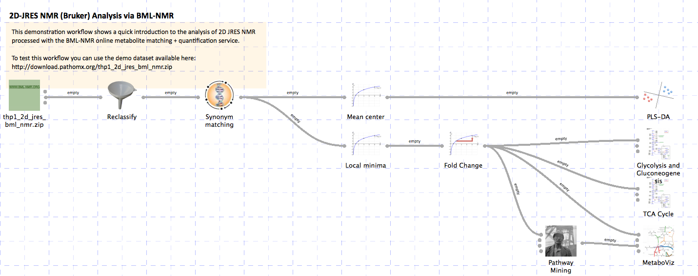
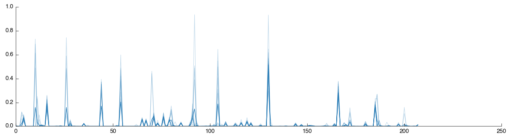
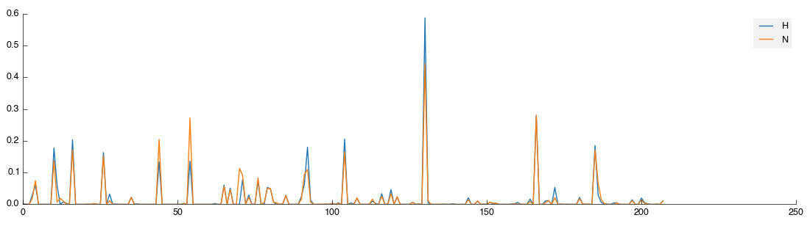
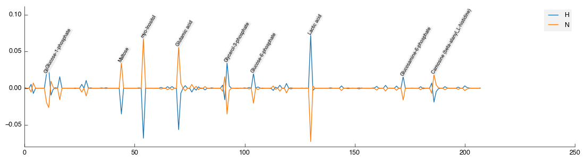
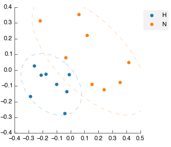
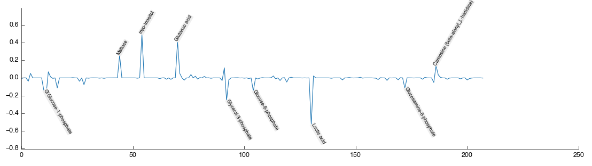
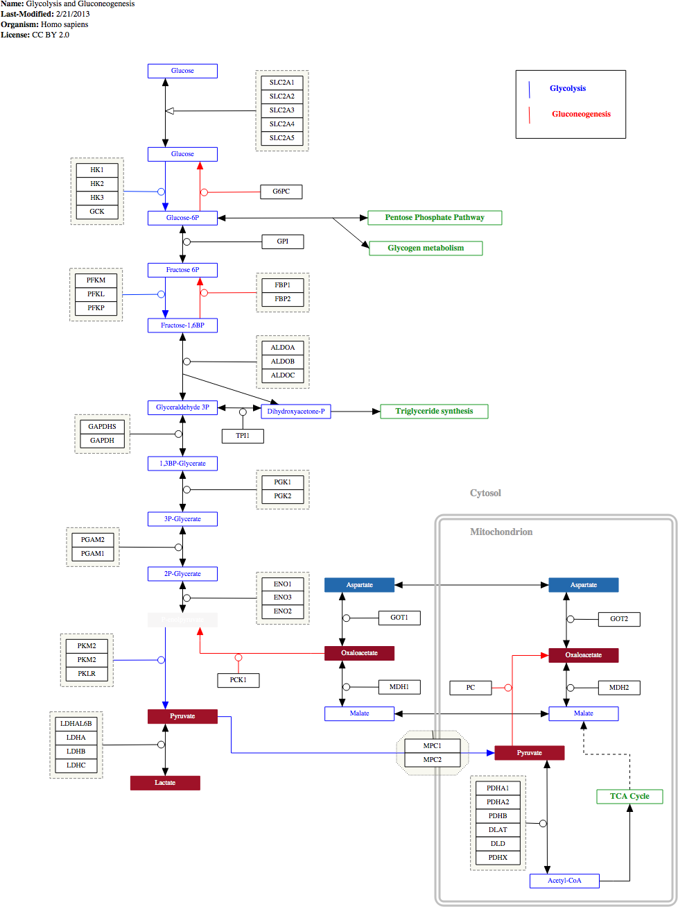
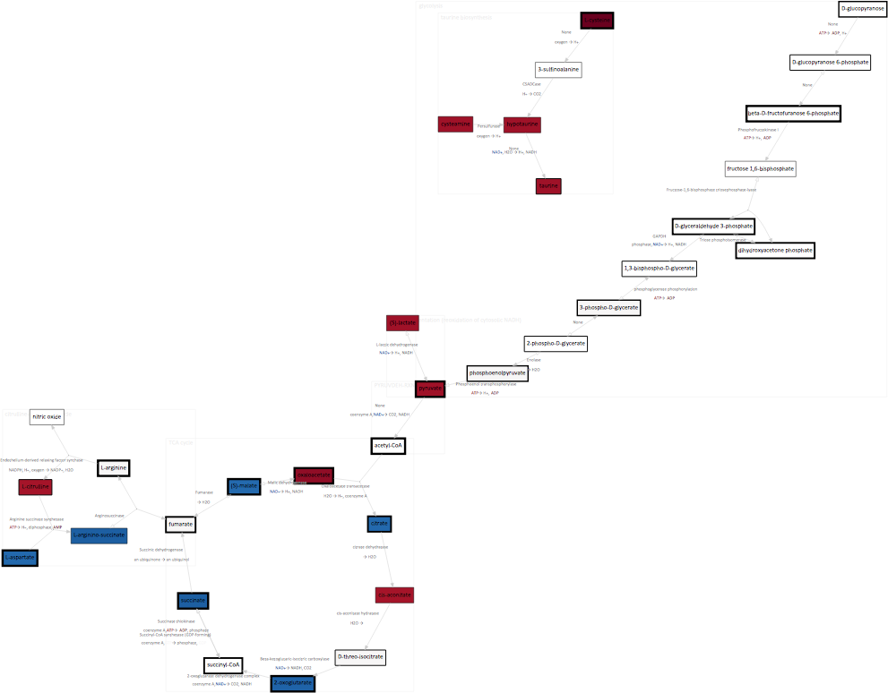

2D-JRES NMR (Bruker) Analysis via BML-NMR
*****************************************

Analysis of 2D J-Resolved NMR spectra (in Bruker format) previously processed using 
the `BML-NMR`_ service. The resulting processed data zip-file is loaded and assigned
experimental classifications. Metabolites are matched by name using the internal database
and then analysed using a PLS-DA. The log2 fold change is calculated for each metabolite 
(replacing zero values with a local minima). The resulting dataset is visualised on 
GPML/WikiPathways metabolic pathways. The data is additionally analysed using a pathway
mining algorithm and visualised using the MetaboViz pathway visualisation tool.

You can download the `completed workflow`_ or follow the steps below to recreate it yourself.
This workflow is also distributed with the latest versions of Pathomx and can be found within
the software via *Help > Demos*.

Background
----------

The Birmingham Metabolite Library (`BML-NMR`_) provided by the University of Birmingham
also hosts an automated NMR spectra fitting service designed for 2D JRES NMR spectra. These
low-resolution spectra have the advantage of being relatively quick to acquire while offering
the resonant peak-separation found in full 2D spectra. Quantification and identification
accuracy is in the 70-80% (dependent on source material) and may be sufficient for quick analyses.

This workflow takes the `.zip` output of the BML-NMR identification service and processes
it to perform multivariate analyses, visualisation on WikiPathways and pathway-analysis-generated
automated pathway visualisation. The overview of the pathway is as follows:

To test the workflow as it's built you'll need to download the `demo dataset`_ and `sample classification`_
files. You don't need to unzip the dataset, it is the exact same format that comes out of 
the BML-NMR service and Pathomx can handle it as-is. The sample classification file is in CSV format
and simply maps the NMR sample numbers to a specific class group.

Constructing the workflow
-------------------------

Things to try out
-----------------

If you're feeling adventurous there are a few things you can experiment with the workflow - 

- Perform a Principal Components Analysis (PCA) *hint: use the output of the Mean Center tool*
- Export the list of mined pathways to a CSV file for use elsewhere
- See if metabolites in the dataset correlate using the Regression tool

.. _completed workflow: http://download.pathomx.org/demos/thp1_2d_jres_bml_nmr.mpf
.. _demo dataset: http://download.pathomx.org/demos/thp1_2d_jres_bml_nmr.zip
.. _sample classification: http://download.pathomx.org/demos/2d_classifications.csv
.. _BML-NMR: http://www.bml-nmr.org/