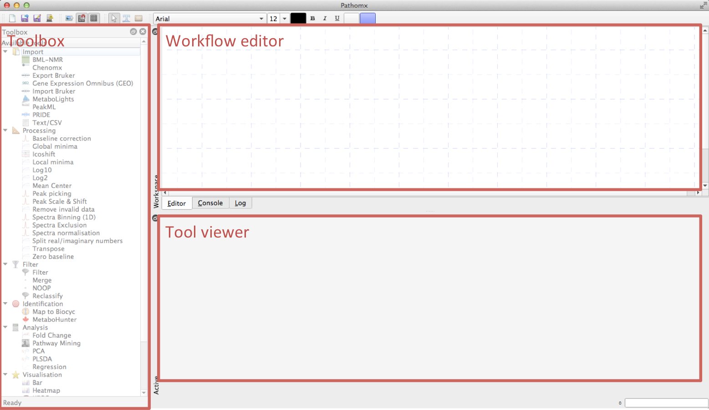
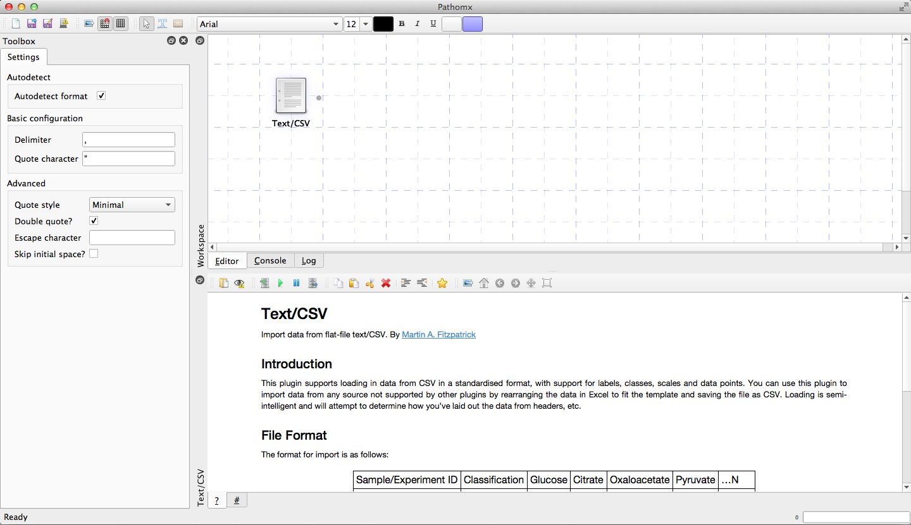
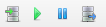
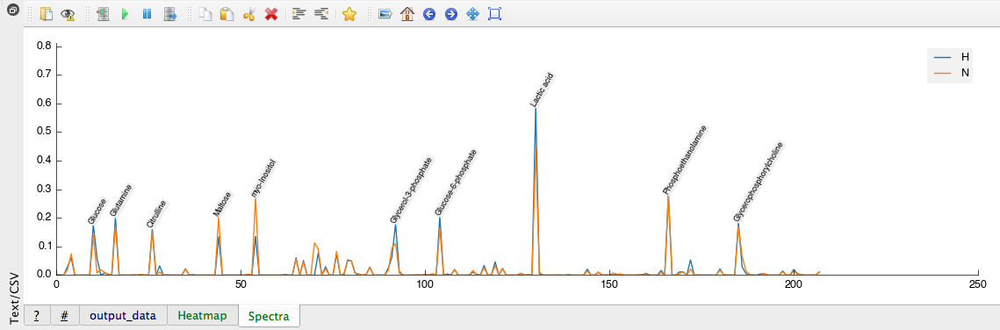
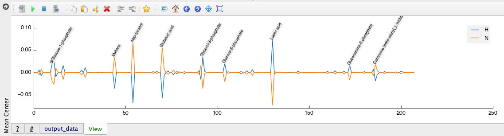
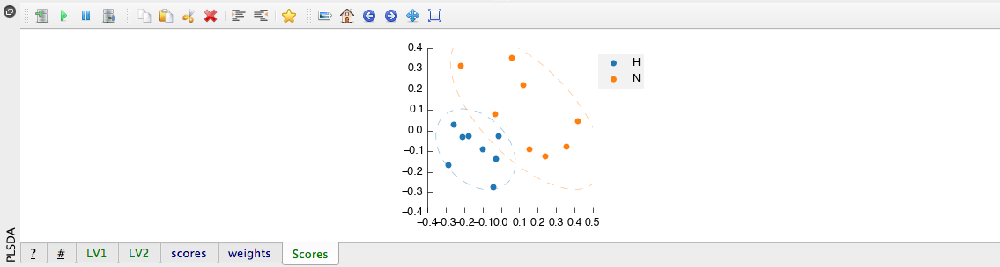
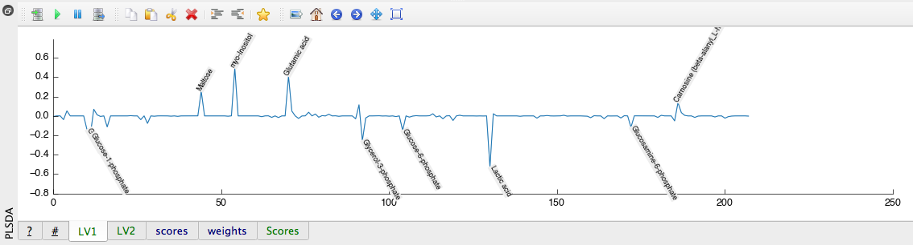
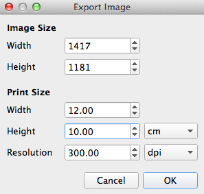

Getting Started
===============

This is quick start-up guide for new users of `Pathomx`_. In here you should find everything
you need to know to start using Pathomx right away. Once you've been through the basics
you might like to see some of the `demo workflows`_ to see what Pathomx is capable of.

Pathomx aims to offer a powerful, extensible analysis and processing platform while being
as simple to use as possible to the casual user. It should be possible to pick up Pathomx,
use the built-in - or bioinformatician provided - tools and perform a complete analysis
in a matter of minutes. Saved workflows should be simple to use, reliable and reproducible.
Outputs should be beautiful.

If Pathomx fails for you on any of those points, please do `file a bug report`_ and it'll 
be sorted out as soon as humanly possible.

First steps
-----------

Before you can start you'll need to `install the software`_. There are a few different ways
to install Pathomx but they make no difference to how you'll use it.

Nomenclature
------------

In Pathomx nomenclature *toolkits* provide *tools* with which you can construct
*workflows*. 

Your currently available tools are shown in the *Toolbox* within the application and can
be dragged into the workspace to use. Once in the workflow tools can be dragged and rearranged
as you like, the position of the tool has no effect on function. 

Each tool has a number (0-infinity) of *ports* for *input* and *output*. Data is taken in
via an input port, processed by the tool in some way, and passed out of the output port. The 
output of one tool can be connected to the input of another by *connectors* which can 
be created by dragging from the output to the input, represented by grey circles.

The interface
-------------

The Pathomx user interface (UI) is separated into 3 regions with specific purposes. These
are dockable and re-arrangeable, but in their default configuration look like the following:

The *workflow editor* in the top right is where you arrange tools to construct workflows. Tools
can be dragged-and-dropped from the *toolbox* then connected up. The are available in the workflow
automatically extends to include all added tools and you can pan around the workflow as normal. 
If you find the workflow space too small you can un-dock it by clicking on the overlapping-window
icon in the top left.

The *tool viewer* is a multi-purpose region that shows the info, code and current outputs for each tool
presented in a tabbed interface. By default the tool information is displayed, but after running
the tool will automatically show the first available output. Some outputs - such as figures - can also be 
displayed directly in the workflow editor.

When a tool is selected the *toolbox* will automatically change to show configuration options for that
tool. In this way it is simple to rapidly reconfigure a processing workflow and see the resulting effects
on the current and downstream tools.

Importing data
--------------

To demonstrate some key features of Pathomx we're going to perform a quick analysis
using the standard toolkit and a demo data file. The downloadable file `can be downloaded here`_.

Start up Pathomx and you'll be presented with an empty workflow editor. To get started we'll first
add a tool that allows us to import this file: *Text/CSV*. Locate the tool in the toolbox and then drag
and drop into the workflow (click-and-hold the tool, then move over the workflow and release). The new
tool will be created in the location where you drop it. Next select the tool to activate it.

Selecting the tool will activate the configuration panel on the left where you can change 
tool settings. Any change to a setting will trigger the automatic re-calculation of the 
tools output. You can control this behaviour by using the *Pause* button on the tool run control toolbar.
The *Play* button manually runs the current tool.

To load the data click the button next to the *filename* configuration box and an "Open file..." 
dialog box will appear. Locate the downloaded file and click OK. The Text/CSV tool will
automatically run, loading the file and generating a set of default output figures (Heatmap, Spectra).
Selecting the Spectra tool output tab will show the figure below:

Processing
----------

Performing further processing of the data is simply a case of adding more tools to the workflow.
To return to the toolbox click any empty space in the workflow editor. Next, select the 
*Mean Center* tool and drag that into the workflow editor, somewhere to the right of the first tool.
You will notice that the tools automatically connect, and the processing is automatically run (tool status bar turns blue).
Any tools you add who's inputs are compatible with a previous tool's outputs will automatically connect
when added. This allows rapid construction of workflows.

Now select the Mean Center tool to show the following output:

The imported data has been mean centered. Next we'll perform a quick multivariate analysis.

Analysis
--------

Multivariate analysis tools are provided in the default analysis toolbox provided with Pathomx: 
Principal Components Analysis (PCA) and Partial Least Squares Discriminant Analysis (PLS-DA).
We'll quickly perform one of each to demonstrate how easy it is to do.

First, the PCA. Find the *PCA* tool in the Toolbox and drag and drop it into the workflow editor.
Again you should see it automatically connect up with the previous (Mean Center) tool and turn 
blue to indicate that the analysis has been successful. You've just done a PCA! Click on the tool
to show the output. Below is the Scores plot:

.. image:: images/getting_started_pca_output.png
    :alt: Principal Component Analysis (PCA) tool output

Next we'll perform the PLS-DA. Find the *PLS-DA* tool in the Toolbox and drag and drop it into
the workflow editor, preferably below the PCA tool. Again it will automatically connect, but this
time incorrectly to the output of the PCA. This is because the output of the PCA is a valid input
for the PLS-DA, however on this occasion this is not what we want. So, to correct the connection
simply drag the output from the Mean Center tool across to the input of the newly created PLS-DA tool.

The tool will recalculate, and you'll get the following outputs:

Figures
-------

Figures generated by any Pathomx tool can be easily exported to high resolution formats (TIF) for 
publication. Selecting outputs (tabs) that support image export will activate the Figure toolbar.
Select the PLS-DA Scores figure and then click on the image export icon (small picture with an arrow) 
will start the image export process.

.. image:: images/getting_started_export_figure.png
    :alt: Partial Least Squares Discriminant Analysis (PLS-DA) tool output (Latent Variable 1)

The image export dialog will appear (below) that allows you change the settings for the
exported image. For example, you can choose a higher/lower dpi setting and the dimensions of
the final image. Resulting images will be automatically scaled to fit your chosen settings. 

For the Scores plot the suggested size to export is 12x10cm and 300dpi for clarity.

Next an File Save dialog will be shown where you can choose the location, filename and file format.
If you select TIF you will get a high-resolution image output at the specified dpi. If you've done
everything correctly, it should look a lot like this:

.. image:: images/getting_started_plsda_export.tif
    :alt: Exported PLS-DA Scores plot as TIF format image 300dpi 12x10cm

Re-using a workflow
-------------------

.. _Pathomx: http://pathomx.org
.. _file a bug report: http://github.com/pathomx/pathomx/issues/
.. _install the software: install.html
.. _can be downloaded here: http://download.pathomx.org/demos/thp1_2d_jres_bml_nmr.csv