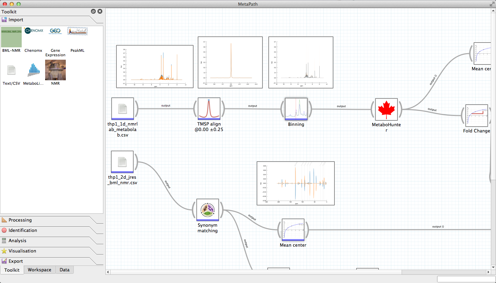

Welcome to Pathomx's documentation
==================================

Pathomx is a workflow-based tool for the analysis of metabolic pathways and visualisation
of associated experimental data. 

    
Workflows can be created, edited and shared using the 
built-in analysis workflow editor. Set up standardised analysis approaches and apply them 
to new data consistently. Add-remove tools to test different approaches, and re-apply 
tried and tested methods to new data. Use the built-in and custom tools to streamline your
data analysis workflow, improving throughput and reproducibility.

Users
==================

.. toctree::
   :maxdepth: 2

   install
   getting_started
   demos/index
   
   support

Developers
==================

Below is API documentation for core/plugin developers. This is a work in progress as 
documentation is added to the source code. You can submit patches via github.

.. toctree::
   :maxdepth: 2
   
   dev_install
   api
   creating_custom_tools

Indices and tables
==================

* :ref:`genindex`
* :ref:`modindex`
* :ref:`search`

