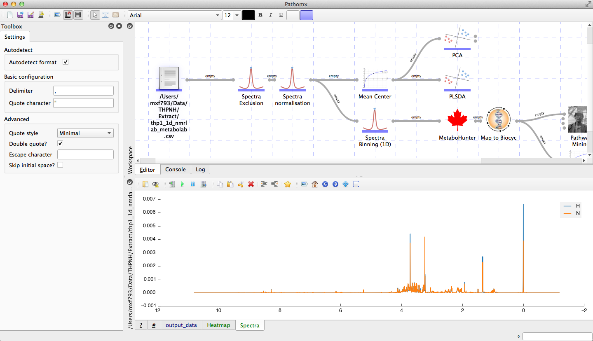

Welcome to Pathomx's documentation
==================================

Pathomx is a workflow-based tool for the analysis and visualisation of experimental data.
Initially created as a tool for metabolomic data analysis is has been extended and can now
be used for any scientific and non-scientific data analysis.

The software functions as a hybrid of workflow and script-based approaches to analysis.
Using workflows it is possible to construct rapid, reproducible analysis constructs for 
experimental data. By combining this with custom inline scripting it is possible to
perform any analysis imaginable. Workflows can be dynamically re-arranged to test 
different approaches and saved to  track the development of your approach. Saved 
workflows can also be shared with other users or groups, allowing instant reproduction 
of results and methods. Tools can export images as publication-ready high resolution 
images in common formats.

This documentation contains useful information, demos and tips for the use of Pathomx by
both users and developers.

Users
==================

.. toctree::
   :maxdepth: 2

   install
   getting_started
   demos/index
   
   support

Developers
==================

Below is documentation for core/plugin developers, including documentation on how to 
set up a developer installation and create custom tools. API documentation is provided but 
is currently a work in progress  documentation is added to the source code. Improvements are
welcomed as pull-requests on Github.

.. toctree::
   :maxdepth: 2
   
   dev_install
   api
   creating_custom_tools

Indices and tables
==================

* :ref:`genindex`
* :ref:`modindex`
* :ref:`search`

